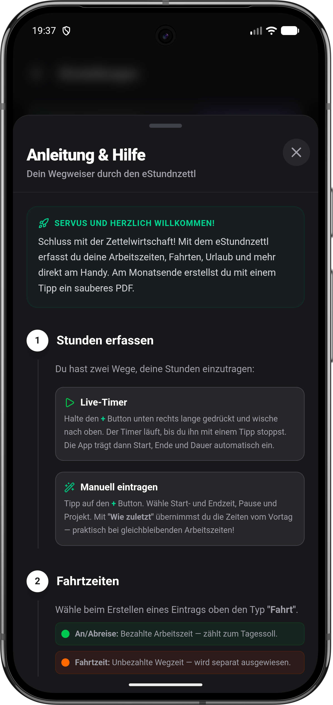

  

<h1 align="center">eStundnzettl</h1>

  <strong>🏔️ Die smarte Zeiterfassung aus der Steiermark.</strong> 
  Schluss mit Zettelwirtschaft — Stunden, Fahrten und Urlaub direkt am Handy erfassen. 
  Am Monatsende ein sauberes PDF. Fertig. ✅

  

---

## 📸 Screenshots

  
  &nbsp;&nbsp;
  
  &nbsp;&nbsp;
  

  
  &nbsp;
  
  &nbsp;
  

  
  &nbsp;&nbsp;
  
  &nbsp;&nbsp;
  

---

## ✨ Highlights

| | Feature | Beschreibung |
|---|---------|--------------|
| 🎯 | **Flexible Arbeitszeitmodelle** | 38,5h, 40h, 4-Tage-Woche oder komplett individuell |
| ⏱️ | **Live-Timer** | Lang drücken, nach oben wischen — Timer läuft |
| 📊 | **Echtzeit-Saldo** | Überstunden, Mehrarbeit und Gleitzeit immer im Blick |
| 📄 | **PDF-Export** | Professioneller Stundenzettel per Monats- oder Wochenansicht |
| ☁️ | **Automatische Backups** | Google Drive, Nextcloud oder lokal — täglich gesichert |
| 📎 | **Dokumente anhängen** | Regiescheine, Fotos und Lieferscheine direkt zum Eintrag |
| 🌙 | **Dark Mode** | Augenschonend, wenn's draußen schon finster ist |
| 🔧 | **Hausmasta-Modus** | Erweiterte Einstellungen für Profis — bei Bedarf aktivierbar |

---

## 🚀 Schnellstart

### 1️⃣ Einrichten — in 2 Minuten startklar

Beim ersten Start führt dich der **Einrichtungs-Assistent** gemütlich durch alles:

- 👤 **Name & Firma** eintragen
- 📅 **Arbeitszeitmodell** wählen (Vollzeit, Teilzeit, 4-Tage-Woche, ...)
- 💾 **Backup** einrichten (optional — Google Drive, lokal oder Nextcloud)

> 🧪 Oder einfach auf **"Nur mal reinschnuppern"** tippen und mit Demo-Daten starten!

### 2️⃣ Stunden erfassen

Drück unten rechts auf den **+** Button — oder nutze den **Live-Timer**:

| Methode | So geht's |
|---------|-----------|
| ▶️ **Live-Timer** | **+** Button lange drücken und nach oben wischen. Timer läuft bis du stoppst. |
| ✏️ **Manuell** | **+** tippen, Zeiten einstellen, Tätigkeit wählen, speichern. |
| 🪄 **Wie zuletzt** | Übernimmt Start, Ende und Pause vom Vortag — ein Tipp genügt. |

### 3️⃣ Fahrtzeiten

Wähle den Typ **"Fahrt"** beim Erstellen:

- 🟢 **An/Abreise** — bezahlte Arbeitszeit, zählt zum Tagessoll
- 🟠 **Fahrtzeit** — unbezahlte Wegzeit, wird separat ausgewiesen

### 4️⃣ Urlaub, Krank & Zeitausgleich

🏖️ Einfach den passenden Typ wählen — die App rechnet automatisch die richtigen Soll-Stunden für den Tag ein. Kein manuelles Rechnen nötig.

### 5️⃣ Dokumente anhängen

📎 Zu jedem Eintrag kannst du Fotos oder Dateien anhängen — Regiescheine, Lieferscheine, Arbeitsberichte. Die Anhänge werden beim PDF-Export automatisch mitgeliefert.

### 6️⃣ Monatsabschluss — PDF erstellen

1. Oben rechts auf das **📊 Bericht-Symbol** tippen
2. Monat oder Kalenderwoche auswählen
3. **📤 PDF teilen** — per Mail, WhatsApp oder lokal speichern

---

## 💾 Backup & Datensicherung

| Ziel | Beschreibung |
|------|-------------|
| ☁️ **Google Drive** | Tägliches Auto-Backup + monatliches PDF-Archiv in deine Cloud |
| 📁 **Lokal** | Backup + PDF in einen Ordner deiner Wahl auf dem Gerät |
| 🖥️ **Nextcloud** | Für volle Datenhoheit auf deiner eigenen Cloud |

> 💡 Alles optional — die App funktioniert auch komplett offline und ohne Backup.

---

## 🔧 Hausmasta-Modus

Für Profis, die mehr wollen! Aktiviere den **Hausmasta-Modus** in den Einstellungen und schalte zusätzliche Features frei:

- 🖥️ **Nextcloud-Integration** — Backup auf deine eigene Cloud
- 📦 **JSON Import/Export** — Daten manuell sichern und übertragen
- 📄 **Automatisches PDF-Archiv** — monatliche PDF-Sicherung auf alle Ziele
- ⏱️ **Minuten-Modus** — 1-Minuten- statt 15-Minuten-Schritte
- 🏷️ **Tätigkeitscodes** — Branchen-Presets oder eigene Codes verwalten
- 📋 **Nur Aufzeichnung** — Stundenerfassung ohne Soll/Ist-Berechnung

---

## 📲 Installation

1. Öffne den [**Google Play Store**](https://play.google.com/store/apps/details?id=com.estundnzettl.app) auf deinem Android-Gerät
2. Tippe auf **Installieren**
3. **Fertig!** 🎉

> 💡 Die App wird über den Play Store automatisch aktualisiert — du hast immer die neueste Version.

---

## 🛡️ Datensicherheit

- 🔒 **Lokal first:** Alle Daten bleiben auf deinem Gerät
- 💾 **Backups:** Optional — lokal, Google Drive oder Nextcloud
- 🚫 **Kein Tracking:** Keine Werbung, keine Analytics, keine Datensammlung
- ✅ **Volle Kontrolle:** Du entscheidest, wohin deine Daten gehen

---

## ☕ A Scherzl spendier'n

Die App is **komplett gratis** und bleibt's a — **kane Werbung, kei Abo, nix**.
Wennst magst und dir die App wos wert is, freu i mi über a kloane Anerkennung via Revolut. Is koa muas, aber a "Vergelt's Gott" hot no nie gschodt. 😄

  

  <em>🏔️ Vergelt's Gott und pfiat di! 🏔️</em>

---

## ⚙️ Tech Stack

| | Technologie |
|---|-------------|
| 🖥️ Frontend | TypeScript, React, Vite |
| 📱 Mobile | Capacitor (Android) |
| 🗄️ Datenbank | SQLite + localStorage (Dual-Write) |
| 📄 PDF | html2pdf.js + React-Renderer |
| ☁️ Cloud | Google Drive API, Nextcloud WebDAV |
| 🧪 Tests | Vitest |

---

## 📝 Changelog

Die vollständige Versionshistorie findest du in der App unter **Einstellungen → Änderungsprotokoll** oder in den [GitHub Releases](https://github.com/D3rPaPaH0d3n/eStundnzettl/releases).

---

  <strong>Ausgetüftelt 💭 von Markus 👨 — und mit Herz ❤️, Hirn 🧠 und KI-Agenten 🤖 gebaut.</strong> 
   
  <em>🏔️ "Damit ka Stund verloren geht!" 🏔️</em>

