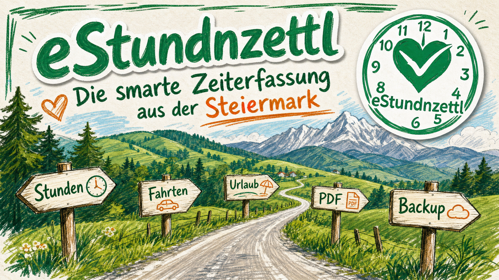

<p align="center">
  
  <a href="./README.en.md"></a>
</p>

<p align="center">
  
</p>

<p align="center">
  <a href="https://github.com/D3rPaPaH0d3n/eStundnzettl/releases/latest"></a>
  <a href="https://github.com/D3rPaPaH0d3n/eStundnzettl/releases"></a>
  <a href="https://github.com/D3rPaPaH0d3n/eStundnzettl/blob/main/LICENSE"></a>
  <a href="https://github.com/D3rPaPaH0d3n/eStundnzettl/actions/workflows/ci.yml"></a>
  <a href="https://github.com/D3rPaPaH0d3n/eStundnzettl/actions/workflows/codeql.yml"></a>
  <a href="https://github.com/D3rPaPaH0d3n/eStundnzettl/actions/workflows/coverage-badge.yml"></a>
</p>

<p align="center">
  
</p>

<h1 align="center">eStundnzettl</h1>

<p align="center">
  <strong>🏔️ Die smarte Zeiterfassung aus der Steiermark.</strong><br />
  Schluss mit Zettelwirtschaft — Stunden, Fahrten und Urlaub direkt am Handy erfassen.<br />
  Am Monatsende ein sauberes PDF. Fertig. ✅
</p>

<p align="center">
  <a href="https://play.google.com/store/apps/details?id=com.estundnzettl.app">
    
  </a>
  <a href="https://github.com/D3rPaPaH0d3n/eStundnzettl/releases/latest">
    
  </a>
</p>

---

## 🌲 Neu aufg'stellt: Version 5.0.0 wird nativ

eStundnzettl wurde für Version 5 vollständig als **native Android-App in Kotlin** neu gebaut. Statt einer WebView arbeiten jetzt **Jetpack Compose, Material 3 und Room** direkt mit Android zusammen — schneller, robuster und trotzdem mit dem vertrauten steirischen Charme. Die native Generation befindet sich derzeit im **Play-Store-Betatest**.

Der `main`-Branch enthält die aktuelle Kotlin-App. Die bisherige Capacitor-Version 4.5.x bleibt für Notfall-Hotfixes und als nachvollziehbare Migrationsreferenz im Branch [`legacy/capacitor-4.5.x`](https://github.com/D3rPaPaH0d3n/eStundnzettl/tree/legacy/capacitor-4.5.x) erhalten.

### Was der Umbau mitbringt

- 📱 **Echte native Oberfläche** — Jetpack Compose und Material You, ganz ohne Capacitor-WebView
- 🧳 **Sichere Datenübernahme** — bestehende Einträge und Einstellungen werden beim Update übernommen; die alte Datenbank bleibt als Rückfallsicherung unangetastet
- 🛡️ **Robustere Wiederherstellung** — geprüfte Backups, Konfliktprüfung und Schutz vor beschädigten Datenständen
- ☁️ **Backup mit Rückmeldung** — Google Drive, Nextcloud und lokale Sicherung; leise, aber sichtbare Hinweise, wenn ein Ziel länger nicht erreichbar ist
- 📄 **Nativer PDF-Bericht** — schnelle Vorschau, Monats- oder Wochenbericht, lokales Archiv und direktes Teilen
- ✉️ **G'scheiter PDF-Versand** — Standard-Empfänger, Betreff, Nachricht und bevorzugte Versand-App frei einstellbar
- ✅ **Charmante Versandbestätigung** — nach erfolgreicher Übergabe gibt's ein freundliches „Passt, übergeben!“
- 🧹 **Aufgeräumte Einstellungen** — kompakte, ein- und ausklappbare Karten mit klaren Statusanzeigen
- 🎯 **Flexibles Monatsziel** — Sollstunden passend zum persönlichen Arbeitsmodell

> Die Beta und die veröffentlichte Play-Store-Version können während des Übergangs noch unterschiedliche Versionsstände haben. Ein Merge nach `main` veröffentlicht die App nicht automatisch — die Freigabe erfolgt bewusst über die Play-Store-Tracks.

---

## 📸 Screenshots

<p align="center">
  
  &nbsp;&nbsp;
  
  &nbsp;&nbsp;
  
</p>

<p align="center">
  
  &nbsp;
  
  &nbsp;
  
</p>

<p align="center">
  
  &nbsp;&nbsp;
  
  &nbsp;&nbsp;
  
</p>

---

## ✨ Highlights

| | Feature | Beschreibung |
|---|---------|--------------|
| 🌲 | **Native Kotlin-App** | Flüssige Compose-Oberfläche ohne WebView und mit Material-You-Unterstützung |
| 🧳 | **Sanftes 5.0-Update** | Automatische Übernahme der bestehenden Capacitor-Daten beim ersten Start |
| 🎯 | **Flexible Arbeitszeitmodelle** | 38,5h, 40h, 4-Tage-Woche oder komplett individuell |
| ⏱️ | **Live-Timer** | Lang drücken, nach oben wischen — Timer läuft |
| 📊 | **Echtzeit-Saldo** | Überstunden, Mehrarbeit und Gleitzeit immer im Blick |
| 🇦🇹 | **Lokale Feiertage** | Österreich, 16 deutsche Bundesländer und 26 Schweizer Kantone |
| 📄 | **PDF-Export** | Professioneller Stundenzettel per Monats- oder Wochenansicht |
| ☁️ | **Automatische Backups** | Google Drive, Nextcloud oder lokal — täglich gesichert |
| 📎 | **Dokumente anhängen** | Regiescheine, Fotos und Lieferscheine direkt zum Eintrag |
| 📴 | **Offline-fähig** | Funktioniert komplett ohne Internet — Cloud ist optional |
| 🚫 | **Kein Tracking** | Keine Werbung, kein Analytics, keine Datensammlung |
| 🌍 | **Bilingual** | Deutsch & Englisch — Sprache in den Einstellungen umschaltbar |
| 🧭 | **Onboarding & Tour** | Geführter Einstieg + interaktive App-Tour beim ersten Start |
| 🌙 | **Dark Mode** | Augenschonend, wenn's draußen schon finster ist |
| 🔧 | **Hausmasta-Modus** | Erweiterte Einstellungen für Profis — bei Bedarf aktivierbar |

---

## 🚀 Schnellstart

### 1️⃣ Einrichten — in 2 Minuten startklar

Beim ersten Start führt dich der **Einrichtungs-Assistent** gemütlich durch alles:

- 👤 **Name & Firma** eintragen
- 📅 **Arbeitszeitmodell** wählen (Vollzeit, Teilzeit, 4-Tage-Woche, ...)
- 💾 **Backup** einrichten (optional — Google Drive, lokal oder Nextcloud)

> 🧪 Oder einfach auf **"Nur mal reinschnuppern"** tippen und mit Demo-Daten starten!

### 2️⃣ Stunden erfassen

Drück unten rechts auf den **+** Button — oder nutze den **Live-Timer**:

| Methode | So geht's |
|---------|-----------|
| ▶️ **Live-Timer** | **+** Button lange drücken und nach oben wischen. Timer läuft bis du stoppst. |
| ✏️ **Manuell** | **+** tippen, Zeiten einstellen, Tätigkeit wählen, speichern. |
| 🪄 **Wie zuletzt** | Übernimmt Start, Ende und Pause vom Vortag — ein Tipp genügt. |

### 3️⃣ Fahrtzeiten

Wähle den Typ **"Fahrt"** beim Erstellen:

- 🟢 **An/Abreise** — bezahlte Arbeitszeit, zählt zum Tagessoll
- 🟠 **Fahrtzeit** — unbezahlte Wegzeit, wird separat ausgewiesen

### 4️⃣ Urlaub, Krank & Zeitausgleich

🏖️ Einfach den passenden Typ wählen — die App rechnet automatisch die richtigen Soll-Stunden für den Tag ein. Kein manuelles Rechnen nötig.

### 5️⃣ Dokumente anhängen

📎 Zu jedem Eintrag kannst du Fotos oder Dateien anhängen — Regiescheine, Lieferscheine, Arbeitsberichte. Die Anhänge werden beim PDF-Export automatisch mitgeliefert.

### 6️⃣ Monatsabschluss — PDF erstellen

1. Oben rechts auf das **📊 Bericht-Symbol** tippen
2. Monat oder Kalenderwoche auswählen
3. **📤 PDF teilen** — per Mail, WhatsApp oder lokal speichern

---

## 💾 Backup & Datensicherung

| Ziel | Beschreibung |
|------|-------------|
| ☁️ **Google Drive** | Tägliches Auto-Backup + monatliches PDF-Archiv in deine Cloud |
| 📁 **Lokal** | Backup + PDF in einen Ordner deiner Wahl auf dem Gerät |
| 🖥️ **Nextcloud** | Für volle Datenhoheit auf deiner eigenen Cloud |

> 💡 Alles optional — die App funktioniert auch komplett offline und ohne Backup.

---

## 🔧 Hausmasta-Modus

Für Profis, die mehr wollen! Aktiviere den **Hausmasta-Modus** in den Einstellungen und schalte zusätzliche Features frei:

- 🖥️ **Nextcloud-Integration** — Backup auf deine eigene Cloud
- 📦 **JSON Import/Export** — Daten manuell sichern und übertragen
- 📄 **Automatisches PDF-Archiv** — monatliche PDF-Sicherung auf alle Ziele
- 🎛️ **PDF-Layout-Toggles** — wähle, welche Felder im PDF erscheinen sollen
- 🏷️ **Tätigkeitscodes** — Branchen-Presets oder eigene Codes verwalten
- 🌍 **Locale-Picker** — Bundesland/Kanton für korrekte Feiertage & Berechnung
- ⏸️ **Auto-Pausen-Regeln** — konfigurierbare Pausenlogik pro Arbeitstyp und Locale
- 📋 **Nur Aufzeichnung** — Stundenerfassung ohne Soll/Ist-Berechnung

---

## 🌐 Sprachen

Die App-Oberfläche gibt's vollständig auf **Deutsch und Englisch**. Unter **Einstellungen → Sprache** kannst du jederzeit umschalten; beim ersten Start wird die Geräte-Sprache automatisch erkannt.

---

## 📲 Installation

1. Öffne den [**Google Play Store**](https://play.google.com/store/apps/details?id=com.estundnzettl.app) auf deinem Android-Gerät
2. Tippe auf **Installieren**
3. **Fertig!** 🎉

> 💡 Die App wird über den Play Store automatisch aktualisiert — du hast immer die neueste Version.

> 🧪 Die native Kotlin-Version 5.0.0 wird aktuell im Beta-Track erprobt. Bis zur Produktionsfreigabe kann der reguläre Store-Eintrag noch die stabile Capacitor-Version 4.5.x ausliefern.

---

## 🛡️ Datensicherheit

- 🔒 **Lokal first:** Alle Daten bleiben auf deinem Gerät
- 💾 **Backups:** Optional — lokal, Google Drive oder Nextcloud
- 🔐 **Sichere Passwörter:** Nextcloud-Zugangsdaten liegen verschlüsselt im Android Keystore-gestützten Speicher
- 🚫 **Kein Tracking:** Keine Werbung, keine Analytics, keine Datensammlung
- 📖 **Open Source:** Kompletter Code einsehbar, MIT-lizenziert
- ✅ **Volle Kontrolle:** Du entscheidest, wohin deine Daten gehen

---

## ☕ A Scherzl spendier'n

Die App is **komplett gratis** und bleibt's a — **kane Werbung, kei Abo, nix**.
Wennst magst und dir die App wos wert is, freu i mi über a kloane Anerkennung via Revolut. Is koa muas, aber a "Vergelt's Gott" hot no nie gschodt. 😄

<p align="center">
  <a href="https://revolut.me/mkainer/pocket/QAt1Q0Ntsb">
    
  </a>
</p>

<p align="center">
  <em>🏔️ Vergelt's Gott und pfiat di! 🏔️</em>
</p>

---

## ⚙️ Tech Stack

| | Technologie |
|---|-------------|
| 📱 App | Kotlin, Android SDK 36, Coroutines |
| 🎨 UI | Jetpack Compose, Material 3, Material You |
| 🧠 Logik | Eigenständiges Kotlin/JVM-`core`-Modul |
| 🗄️ Datenbank | Room auf SQLite, kompatible Übernahme der Capacitor-Datenbank |
| 📄 PDF | `PdfDocument` für Vektor-PDFs, `PdfRenderer` für die native Vorschau |
| ☁️ Cloud | Google Drive REST API, Nextcloud WebDAV, Storage Access Framework |
| 🔐 Geheimnisse | AndroidX Security Crypto und Android Keystore |
| 🌐 Sprachen | Native DE/EN-Ressourcen aus einer gemeinsamen JSON-Quelle |
| 🧪 Tests | JUnit, Kotlin Test, AndroidX Instrumentation und Vitest-Paritätstests |

### Repository-Aufbau

| Pfad | Aufgabe |
|------|---------|
| `native/` | Aktuelle Kotlin-App und primärer Android-Build |
| `src/` und `android/` | Frühere Capacitor-App — vorerst für Migration und Vergleichstests erhalten |
| `fastlane/metadata/` | Versionshinweise für Google Play |
| `.github/workflows/` | Native CI-, APK-, GitHub-Release- und Play-Store-Builds |

Für einen lokalen Debug-Build unter Windows:

```powershell
cd native
.\gradlew.bat :core:test :app:testDebugUnitTest :app:assembleDebug
```

`main` ist die Entwicklungsbasis der Kotlin-App. Der eingefrorene Capacitor-Stand liegt unter `legacy/capacitor-4.5.x`.

---

## 📝 Changelog

Die vollständige Versionshistorie findest du in der App unter **Einstellungen → Änderungsprotokoll** oder in den [GitHub Releases](https://github.com/D3rPaPaH0d3n/eStundnzettl/releases).

---

## 📄 Lizenz

Der Quellcode dieses Projekts steht unter der **[MIT-Lizenz](./LICENSE)**.

Du darfst den Code verwenden, kopieren, ändern und weiterverbreiten — solange der Copyright-Vermerk `Copyright (c) 2024-2026 Markus Kainer` und der Lizenztext enthalten bleiben. Kurz gesagt: **Wer den Code nutzt, muss mich erwähnen.** ✌️

---

## ™️ Name & Logo

Die MIT-Lizenz deckt **nur den Quellcode** ab. Der Name **"eStundnzettl"**, das App-Logo, das visuelle Erscheinungsbild und die Screenshots sind **nicht** Teil der Open-Source-Lizenz und bleiben geschützt.

👉 Details dazu in der [**TRADEMARK.md**](./TRADEMARK.md).

Kurzversion: Forks bitte gerne — aber unter eigenem Namen und mit eigenem Logo. 🙏

---

## 📬 Kontakt

Fragen, Lizenzanfragen, Markenrechts-Themen oder Bug-Reports?

**[project@kainer.co.at](mailto:project@kainer.co.at)**

---

<p align="center">
  <strong>Ausgetüftelt 💭 von Markus 👨 — und mit Herz ❤️, Hirn 🧠 und KI-Agenten 🤖 gebaut.</strong><br />
  <br />
  <em>🏔️ "Damit ka Stund verloren geht!" 🏔️</em>
</p>
