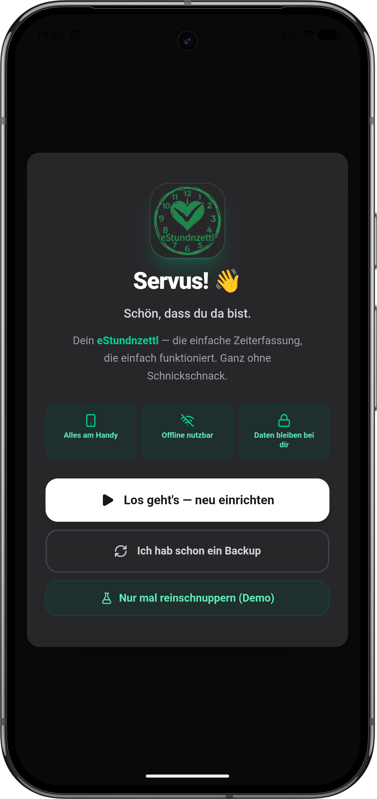
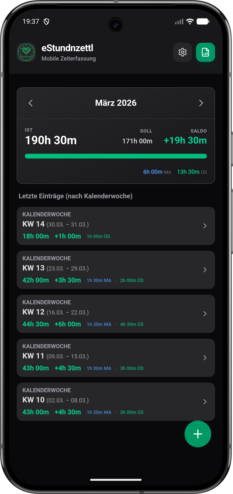
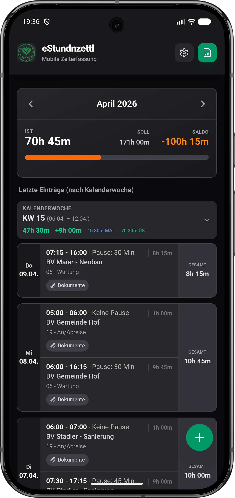
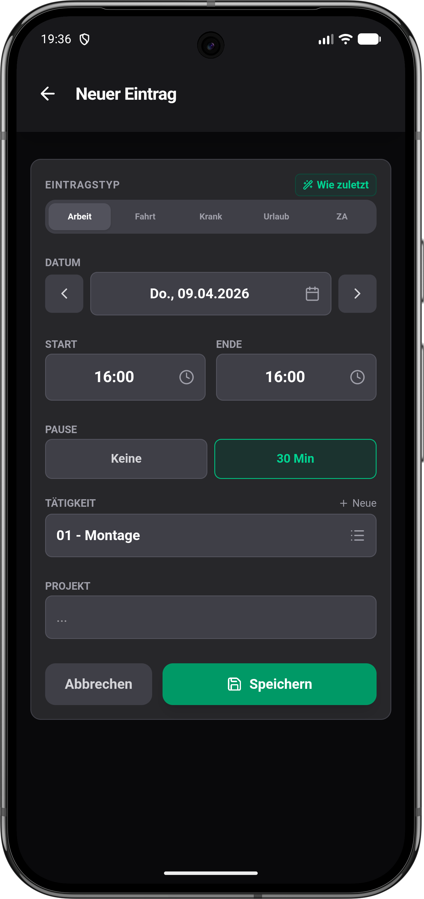
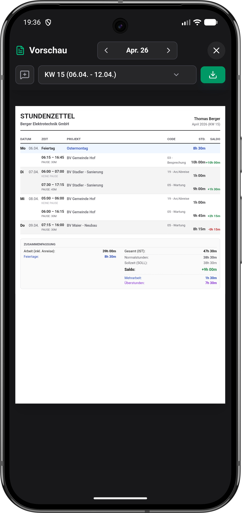
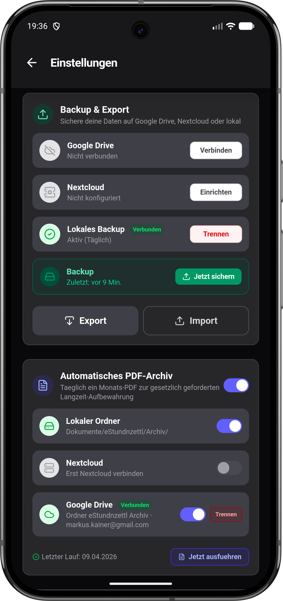
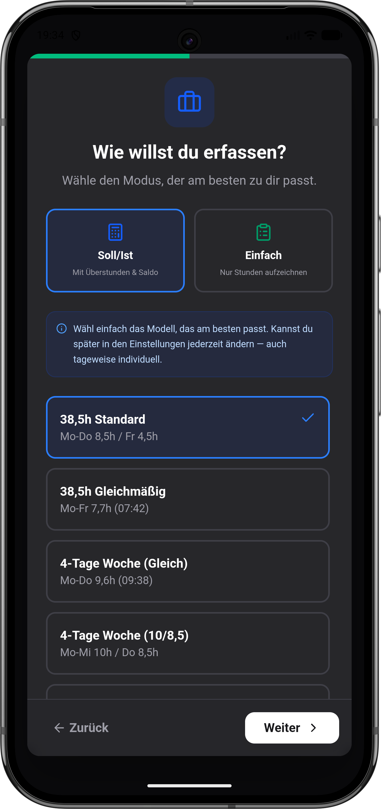
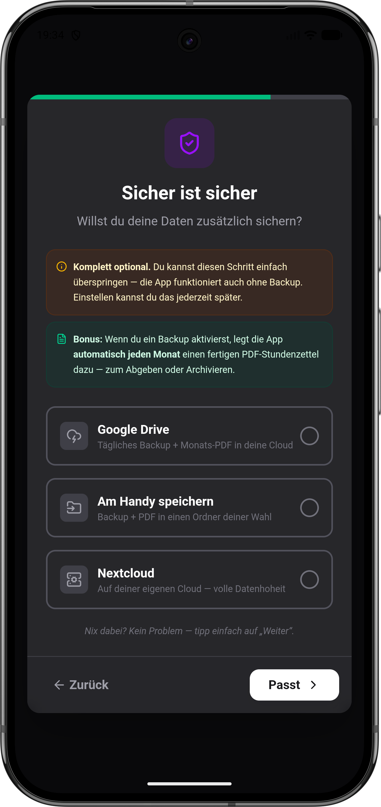

  

<h1 align="center">eStundnzettl</h1>

  <strong>Die smarte Zeiterfassung aus der Steiermark.</strong> 
  Schluss mit Zettelwirtschaft — Stunden, Fahrten und Urlaub direkt am Handy erfassen. 
  Am Monatsende ein sauberes PDF. Fertig.

  
  

  

---

## Screenshots

  
  
  
  

  
  
  
  

---

## Highlights

| | Feature | Beschreibung |
|---|---------|--------------|
| :dart: | **Flexible Arbeitszeitmodelle** | 38,5h, 40h, 4-Tage-Woche oder komplett individuell |
| :stopwatch: | **Live-Timer** | Lang drücken, nach oben wischen — Timer läuft |
| :chart_with_upwards_trend: | **Echtzeit-Saldo** | Überstunden, Mehrarbeit und Gleitzeit immer im Blick |
| :page_facing_up: | **PDF-Export** | Professioneller Stundenzettel per Monats- oder Wochenansicht |
| :cloud: | **Automatische Backups** | Google Drive, Nextcloud oder lokal — täglich gesichert |
| :paperclip: | **Dokumente anhängen** | Regiescheine, Fotos und Lieferscheine direkt zum Eintrag |
| :new_moon: | **Dark Mode** | Augenschonend, wenn's draußen schon finster ist |
| :wrench: | **Hausmasta-Modus** | Erweiterte Einstellungen für Profis — bei Bedarf aktivierbar |

---

## Schnellstart

### 1. Einrichten — in 2 Minuten startklar

Beim ersten Start führt dich der **Einrichtungs-Assistent** gemütlich durch alles:

- **Name & Firma** eintragen
- **Arbeitszeitmodell** wählen (Vollzeit, Teilzeit, 4-Tage-Woche, ...)
- **Backup** einrichten (optional — Google Drive, lokal oder Nextcloud)

> Oder einfach auf **"Nur mal reinschnuppern"** tippen und mit Demo-Daten starten!

### 2. Stunden erfassen

Drück unten rechts auf den **+** Button — oder nutze den **Live-Timer**:

| Methode | So geht's |
|---------|-----------|
| **Live-Timer** | **+** Button lange drücken und nach oben wischen. Timer läuft bis du stoppst. |
| **Manuell** | **+** tippen, Zeiten einstellen, Tätigkeit wählen, speichern. |
| **Wie zuletzt** | Übernimmt Start, Ende und Pause vom Vortag — ein Tipp genügt. |

### 3. Fahrtzeiten

Wähle den Typ **"Fahrt"** beim Erstellen:

- **An/Abreise** — bezahlte Arbeitszeit, zählt zum Tagessoll
- **Fahrtzeit** — unbezahlte Wegzeit, wird separat ausgewiesen

### 4. Urlaub, Krank & Zeitausgleich

Einfach den passenden Typ wählen — die App rechnet automatisch die richtigen Soll-Stunden für den Tag ein. Kein manuelles Rechnen nötig.

### 5. Dokumente anhängen

Zu jedem Eintrag kannst du Fotos oder Dateien anhängen — Regiescheine, Lieferscheine, Arbeitsberichte. Die Anhänge werden beim PDF-Export automatisch mitgeliefert.

### 6. Monatsabschluss — PDF erstellen

1. Oben rechts auf das **Bericht-Symbol** tippen
2. Monat oder Kalenderwoche auswählen
3. **PDF teilen** — per Mail, WhatsApp oder lokal speichern

---

## Backup & Datensicherung

| Ziel | Beschreibung |
|------|-------------|
| **Google Drive** | Tägliches Auto-Backup + monatliches PDF-Archiv in deine Cloud |
| **Lokal** | Backup + PDF in einen Ordner deiner Wahl auf dem Gerät |
| **Nextcloud** | Für volle Datenhoheit auf deiner eigenen Cloud |

> Alles optional — die App funktioniert auch komplett offline und ohne Backup.

---

## Hausmasta-Modus

Für Profis, die mehr wollen! Aktiviere den **Hausmasta-Modus** in den Einstellungen und schalte zusätzliche Features frei:

- **Nextcloud-Integration** — Backup auf deine eigene Cloud
- **JSON Import/Export** — Daten manuell sichern und übertragen
- **Automatisches PDF-Archiv** — monatliche PDF-Sicherung auf alle Ziele
- **Minuten-Modus** — 1-Minuten- statt 15-Minuten-Schritte
- **Tätigkeitscodes** — Branchen-Presets oder eigene Codes verwalten
- **Nur Aufzeichnung** — Stundenerfassung ohne Soll/Ist-Berechnung

---

## Installation

<b>Android (APK)</b>

**Schritt 1: Herunterladen**
Klick oben auf den grünen Button **"Android App — APK herunterladen"**.

**Schritt 2: Installieren**
1. Öffne die heruntergeladene Datei (meist im Ordner "Downloads").
2. Falls eine Warnung kommt: Geh auf **Einstellungen** und erlaube **"Unbekannte Apps installieren"**.
3. Tippe auf **Installieren**.

**Fertig!** :tada:

---

## Datensicherheit

- **Lokal first:** Alle Daten bleiben auf deinem Gerät
- **Backups:** Optional — lokal, Google Drive oder Nextcloud
- **Kein Tracking:** Keine Werbung, keine Analytics, keine Datensammlung
- **Volle Kontrolle:** Du entscheidest, wohin deine Daten gehen

---

## Tech Stack

| | Technologie |
|---|-------------|
| Frontend | TypeScript, React, Vite |
| Mobile | Capacitor (Android) |
| Datenbank | SQLite + localStorage (Dual-Write) |
| PDF | html2pdf.js + React-Renderer |
| Cloud | Google Drive API, Nextcloud WebDAV |
| Tests | Vitest |

---

## Changelog

Die vollständige Versionshistorie findest du in der App unter **Einstellungen > Änderungsprotokoll** oder in den [GitHub Releases](https://github.com/D3rPaPaH0d3n/eStundnzettl/releases).

---

  <strong>Ausgetüftelt :thought_balloon: von Markus :man: — und mit Herz :heart:, Hirn :brain: und KI-Agenten :robot: gebaut.</strong> 
  <em>"Damit ka Stund verloren geht!"</em>

